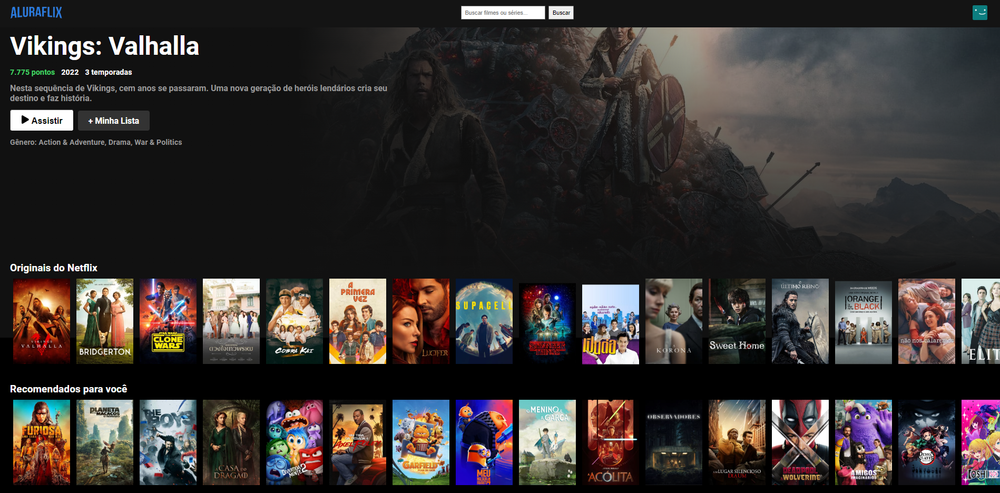

 
 

  #### Projeto desenvolvido no programa ONE - Alura e Oracle
  # Aluraflix

Aluraflix é uma plataforma de streaming de vídeos educacionais inspirada na interface da Netflix. Este projeto foi desenvolvido como parte do desafio Aluraflix da Alura.

 
  ## 🛠️Funcionalidades do projeto
  - Navegação por categorias de filmes.
  - Visualização de detalhes dos filmes.
  - Reproduzir trailers em um modal.
  - Barra de pesquisa para que os usuários possam encontrar filmes ou séries rapidamente.
  - Design responsivo que permite que o usuário acesse de dispositivos diferentes. 
  

  ## ⌨️Tecnologias utilizadas
  
   - **CSS**
   - **JavaScript**
   - **React**: Biblioteca JavaScript para construção de interfaces de usuário.
   -  **TMDb API**: The Movie Database API, usada para buscar informações sobre filmes.
   - **React Icons**: Biblioteca de ícones para React.
   - **npm**: Gerenciador de pacotes para instalação das dependências do projeto.
   

   ## Créditos
   - [B7web](https://lp.b7web.com.br/)
   - [TMDB](Themoviedb.org)

   ## 🔗Acesso ao projeto
   Acesse: (https://thiarafernandes.github.io/aluraflix/)

